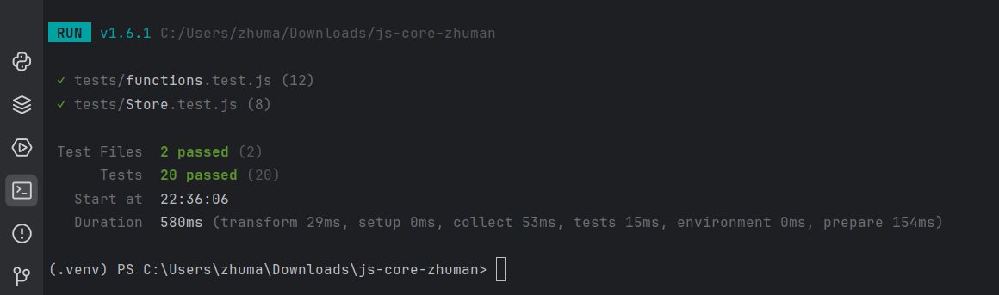

# Lab 4 — JavaScript Core

**Repository:** js-core-zhuman
**Author:** Zhuman Ayan

## How to run tests
1. Install dependencies: `npm install`
2. Run tests: `npm test`

## Closures in my code
In my code, I implemented closures in the `memoize` and `counter` functions. A closure is a function that remembers its outer variables even after the outer function has finished executing. In `memoize(fn)`, the inner function closes over the `cache` Map, allowing it to remember previously calculated results. In `counter()`, the returned methods `inc`, `dec`, and `value` share access to the private `count` variable. This provides data encapsulation because external code cannot directly modify `count`.

## Implemented Features
Core Functions (src/functions.js)
unique(arr): Removes duplicate values from an array using Set. Returns an empty array [] for non-array inputs.

groupBy(arr, keyFn): Groups array elements into an object based on the calculated key function. Returns {} for invalid inputs.

chunk(arr, size): Divides an array into sub-arrays of a specified chunk size. Returns [] if size <= 0 or input is invalid.

deepClone(obj): Recursively creates a deep copy of objects, nested arrays, and Date instances without using JSON.parse(JSON.stringify()).

memoize(fn): Caches function execution results using closures to optimize repetitive function executions.

counter(initialValue): A closure-based factory function returning an object with inc(), dec(), and value() methods to encapsulate state securely.

Classes & Inheritance (src/Store.js)
Store: Manages inventory items containing { name, price, qty }. Features private fields (#items), item validation via static method Store.isValidItem(), methods for add(), remove(), find(), a total() sum calculator, and a getter for items.

SortedStore: Extends the Store class and overrides the add() method using super.add() to maintain items sorted alphabetically by name.

## Closures in My Code
A closure occurs when an inner function retains access to variables from its outer lexical scope even after the outer function has finished executing.

In counter(), the variable count is declared inside the function body, while the returned methods (inc, dec, value) are defined within that same lexical scope. This allows these methods to maintain access to count while keeping it completely encapsulated and inaccessible from direct external modification. Each invocation of counter() creates an isolated lexical environment.

Similarly, memoize(fn) utilizes a closure to preserve an internal cache Map across multiple invocations. The returned inner function checks this persistent cache before executing fn, avoiding redundant computations and optimizing performance.
## Test Results

## AI Tools
- ChatGPT / Claude for writing tests and structure.